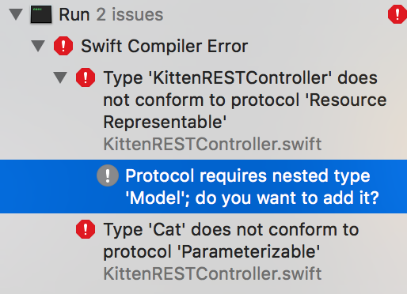

# Server Side Swift w/ Vapor - Part III
An intro to Server Side Swift using Vapor
---

### Readings:

1. [RESTful Controllers - RW](https://videos.raywenderlich.com/screencasts/537-server-side-swift-with-vapor-restful-controllers)

### Helpful Resources:
1. [Vapor - Big Nerd Ranch](https://www.bignerdranch.com/blog/server-side-swift-with-vapor/)

### API Reference: 
1. [Vapor API Reference](http://api.vapor.codes/)

---

### RESTful Controllers (Intermediate Routing)

You may recall that the RESTful API's we've consumed in the pass all generally had the same set of endpoints to hit: one for getting a single object, another for creating a new object, another for updating it, another for deleting, etc.. Well, Vapor knows that Swift developers would want to create a similar structure for their code. And such, they added the `ResourceRepresentable` protocol. The `ResourceRepresentable` protocol more easily allows you to handle common RESTful requests. 

> Create a new file, `KittenRESTController.swift`

The code starts out simple enough, as `ResourceRepresentable` only has one required method `makeResource() -> Resource`

```swift
final class KittenRESTController: ResourceRepresentable {
  func makeResource() -> Resource<Cat> {
    
    return Resource()
  }
}
```

Though if we try to build at this point, we're met with an error: 



In order to set up this RESTful controller, we're going to need to implement the `Model` protocol on our `Cat` object. Which fortunately, is not all that difficult. We just have to implement two functions `init(row:) throws` and `makeRow() throws -> Row`. The basics to the implementation are very straightforward so here is the code: 

```swift 
final class Cat: Model, NodeInitializable, NodeRepresentable {

  // ... all of the other code ...

  // MARK: Persistance Storage / Fluent
  func makeRow() throws -> Row {
    var row = Row()
    try row.set("name", self.name)
    try row.set("breed", self.breed)
    try row.set("snack", self.snack)
    return row
  }
  
  init(row: Row) throws {
    self.name = try row.get("name")
    self.breed = try row.get("breed")
    self.snack = try row.get("snack")
  }
```