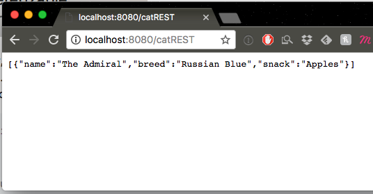

# Server Side Swift w/ Vapor - Part III
An intro to Server Side Swift using Vapor
---

### Readings:

1. [RESTful Controllers - RW](https://videos.raywenderlich.com/screencasts/537-server-side-swift-with-vapor-restful-controllers)
2. [Server Side Swift with Vapor: Persisting Models - RW](https://videos.raywenderlich.com/screencasts/513-server-side-swift-with-vapor-persisting-models)
3. [Server Side Swift with Vapor: CRUD Database Options - RW](https://videos.raywenderlich.com/screencasts/515-server-side-swift-with-vapor-crud-database-options)

### Helpful Resources:
1. [Vapor - Big Nerd Ranch](https://www.bignerdranch.com/blog/server-side-swift-with-vapor/)

### API Reference: 
1. [Vapor API Reference](http://api.vapor.codes/)

---

### RESTful Controllers (Intermediate Routing)

You may recall that the RESTful API's we've consumed in the pass all generally had the same set of endpoints to hit: one for getting a single object, another for creating a new object, another for updating it, another for deleting, etc.. Well, Vapor knows that Swift developers would want to create a similar structure for their code. And such, they added the `ResourceRepresentable` protocol. The `ResourceRepresentable` protocol more easily allows you to handle common RESTful requests. 

> Create a new file, `CatRESTController.swift`

The code starts out simple enough, as `ResourceRepresentable` only has one required method `makeResource() -> Resource`

```swift
final class CatRESTController: ResourceRepresentable {
  func makeResource() -> Resource<Cat> {
    
    return Resource()
  }
}
```

Though if we try to build at this point, we're met with an error: 


In order to set up this RESTful controller, we're going to need to implement the `Model` protocol on our `Cat` object. Which fortunately, is not all that difficult. We just have to implement two functions `init(row:) throws` and `makeRow() throws -> Row`. The basics to the implementation are very straightforward so here is the code: 

```swift 
final class Cat: Model, NodeInitializable, NodeRepresentable {

  // ... all of the other code ...

  // MARK: Persistance Storage / Fluent
  func makeRow() throws -> Row {
    var row = Row()
    try row.set("name", self.name)
    try row.set("breed", self.breed)
    try row.set("snack", self.snack)
    return row
  }
  
  init(row: Row) throws {
    self.name = try row.get("name")
    self.breed = try row.get("breed")
    self.snack = try row.get("snack")
  }
```

In order for us to not have to worry about setting up the actual database and tables, we have `Cat` conform to one more protocol, `Preparation`:

```swift
// MARK: Preparation
extension Cat: Preparation {
  static func prepare(_ database: Database) throws {
    
    try database.create(Cat.self) { creator in
      creator.id()
      creator.string("name")
      creator.string("breed")
      creator.string("snack")
    }
  }
  
  static func revert(_ database: Database) throws {
    try database.delete(Cat.self)
  }
}
```

Id encourage you to look at the documentation for the protocols and the `Creator` object, along with the `Database` object for a deeper understanding of what is happening. But it suffices for now to look at the code and to simply understand that in the `prepare(_:)` method, we're creating a database table with 4 columns: `id, name, breed, snack`. The `revert` function is used to clear the database should we want to clear everything one. 

> **Note** the function itself isn't called from Xcode, it's the code that gets run from the command line as `vapor build` followed by `vapor run prepare --revert`

Back in our `CatRESTController` we can now go back and start filling in our functions. We're going to start with just two: one to display all of our cats, and one to add a single `Cat` to our database. Just like before, we're tasked with creating functions that match the type `(Request) throws -> ResponseRepresentable`.

#### Index

Thanks to conforming to `Model`, we're going to get a lot of database querying for free. For example, our `index` function whose goal is to display a list of all `Cat` objects is going to have a very simple execution statement: 

```swift
final class CatRESTController: ResourceRepresentable {
  
  func index(_ request: Request) throws -> ResponseRepresentable {
    return try Cat.all().makeJSON()
  }
  
  // The only way for your resource to work here, is if it conforms to the Model protocol
  func makeResource() -> Resource<Cat> {
    return Resource(index:  index)
  }

}
```

That `.all()` function is a result of having `Cat` conform to `Model` which is a protocol declared in the `Fluent` module. To get a representation that we can use, it's as simple as calling `makeJSON()` and returning the result. 

> Remember Fluent?

We also need to fill out the `makeResource` function by having it return a `Resource` object with a single handler for the `index` call. 

#### Registering our `Resource`

Just like before, we need to let our Vapor server where this `CatRESTController` is in relation to our base URL. Though instead of specifying the endpoint name by calling `.get()` and passing a string, we need to set our `CatRESTController` as a **resource** because it is now RESTful. In our `main.swift` we just add:

```swift
try drop.resource("catREST", CatRESTController.self)
```

This effectively creates a `/catREST` endpoint with a number of (potential) `HTTP` requests. At this point, we can test this in Postman and navigate to `localhost:8080/catREST` to observe an empty array to verify that our URL is working. 

#### Creating `Cat`

We should try adding a new `Cat` to our database to see that everything is working well. So, lets define a new function called `create` that will create a new `Cat` and save it. Take a moment now to try to fill the basic functionality before looking below:

```swift
	func create(_ request: Request) throws -> ResponseRepresentable {
    	
    	// 1.
    	guard
      		let catName = request.json?["cat_name"]?.string,
      		let catBreed = request.json?["cat_breed"]?.string,
      		let catSnack = request.json?["cat_snack"]?.string 
      	else {
        	throw Abort.badRequest
    	}
    	
    	// 2.
    	let newCat = Cat(name: catName, breed: catBreed, snack: catSnack)
    	try newCat.save()

    	// 3.
    	return try JSON(node: ["success": true, "cat" : newCat])
  	}
 ```

1. The first step involves inspecting the `JSON` of the `Request` object for the key/value pairs needed to define the properties of a `Cat`, otherwise we throw an error if the request is malformed.
2. Having guaranteed our necessary params, we create an instance of `Cat` and use our new, and free, method `save()` to attempt to store the `Cat` to our database.
3. Lastly, we return a response `JSON` to let us know that all went well with storing. 

We need to add this handler to the endpoint, so update `makeResource` to include this new function:

```swift
	func makeResource() -> Resource<Cat> {
    	return Resource(index:  index,
        	            store: create
  	}
```

And the final bit of code we're going to add is to `Config+Setup.swift` in order to ensure that our database schema is set up when the app is run:

```swift
	/// Add all models that should have their
    /// schemas prepared before the app boots
    private func setupPreparations() throws {
        preparations += [Post.self]
        preparations += [Cat.self] // add this line
    }
```

Now, let's try to add a new `Cat` by making a `POST` request to `/catREST`:

> 

Verify our success: 

> 

And lastly, check for its existance by making a `GET` request to `/catREST`:

> 

You might be wondering: Why is it that we don't call `/catREST/index` or `/catREST/create`? Well, that's just how it works after you've conformed to the `ResourceRepresentable` protocol: you requests are handled differently according to web conventions. If you're curious about this further, look at the `Resource` class in the `Vapor` module. 

#### Show

OK let's do just one more for the `show` function which is used to retrieve a single resource object based on its unique identifier, which for our `Cat`s is an id that gets generated automatically for us. The request will be a `GET` and endpoint will look like `/catREST/:id` where the `id` is an `Int` parameter corresponding to the appropriate cat `Cat`.

Implementing `show` is pretty easy, but one thing we need to take account of is that the function type for `show` expects a type `Item` which happens to be a `typealias` defined in `Resource` as `(Request, Model) throws -> ResponseRepresentable`. What the type tells us, is that in addition to the `Request` parameter, we're going to have a second parameter of type `Model`. Simply put, that `Model` object is going to correspond to the `Cat` that we should be passing back:

```swift
  // show expects a function of type (Request, Model) throws -> ResponseRepresentable
  func show(_ request: Request, cat: Cat) throws -> ResponseRepresentable {
    return cat
  }

  // let's not forget to update this as well 
  func makeResource() -> Resource<Cat> {
    return Resource(index:  index,
                    store: create,
                    show: show)
  }
```

> Advanced: Why is it that we can replace `Model` with a type `Cat` in our `show` function? Well, if you looked at the `ResourceRepresentable` protocol you would have noticed that it has an `associatedtype` of `Model: Parameterizable`. We conformed our `Cat` object to `Model` which automatically is made `Parameterizable` by Vapor. `ResourceRepresentable` has that single function that needs implementing: `func makeResource() -> Resource<Model>`. When we implemented our `CatRESTController` with `func makeResource() -> Resource<Cat>` we implicitly stated that our class's `associatedtype` would be `Cat`, therefor we can rewrite the `Item typealias` to use our class's `associatedtype Model` as being `Cat`. 

Rerun the project and check out `/catREST` first. Notice anything odd? (*hint: where did our cats go?*)

**NOTE: Persistance Drivers**

The database library, Fluent, that is built in with Vapor is an in-memory datastore by default. This means that the database is created, used and destroyed within the lifetime of the app's run. We're probably going to want to do some sort of permanent storage though!! We're going to return to this shortly, but for now, just make a few `POST` requests to fill up our db with something we can work with. 

After you've added in a few `Cat`s, go ahead and make a `GET` request to the index to make sure you see them all. And lastly, make a request to `catREST/:id` to see if you can access individual `Cat` entries. 

> 

Congrats! We have implemented local (semi-)persistant storage. 

### Adding PostgreSQL for true permanent storage

Navigate to the Vapor Community page for [PostgreSQL](https://github.com/vapor-community/postgresql-provider). This package is maintained by the open source community so that all may benefit from using this technology. Each package for Vapor is given a list of detailed instructions on the repo's `README` on how to implement the library. In implementing this package, we're going to have our project backed by `PostgreSQL`, which is a permanent data storage option, as opposed to Fluent's in-memory option. To do this (as stated on the `README`) we need:

1. Add the dependacy to our `Package.swift` file
	- `.Package(url: "https://github.com/vapor/postgresql-provider.git", majorVersion: 2, minor: 0)`
2. Rebuild our project so it has the new dependency
	- `$ vapor build` / `$ vapor xcode`
3. Register our provider with our Droplet
4. Adding the `"driver": "postgresql"` key/value to `config/fluent.json` and replace `"driver":"memory"`
5. Creating a `config/secrets/postgresql.json` file (add the basic json from the link)

If we have all of the above in place, now making `POST` requests to `/catREST` should store our data in a SQL database that persists between runs of the app. Let's go ahead and test this out to make sure that this is the case.

### Future topics:

1. Displaying our data with Leaf
2. Pushing to Heroku


